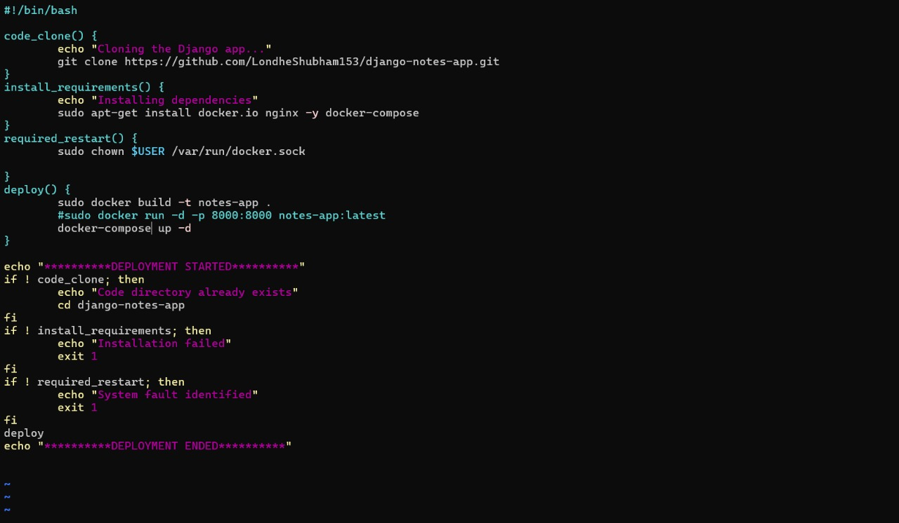
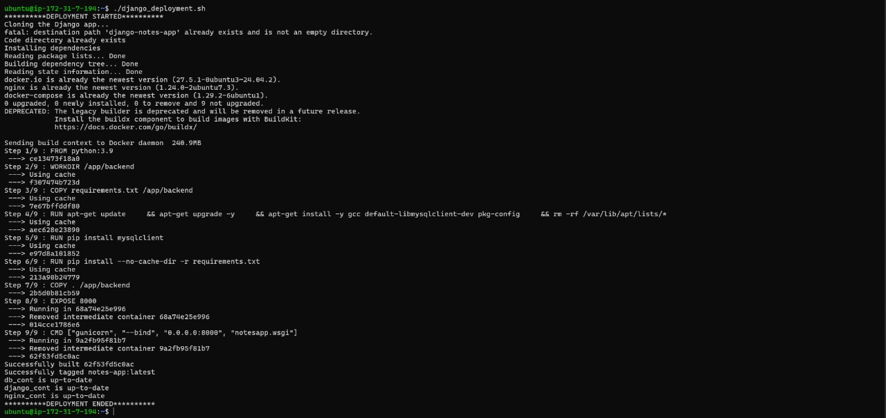
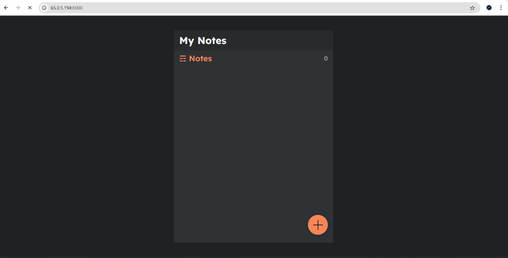

# 🚀 Django Deployment Using Bash


Automated deployment of a *Django* web app using *Bash*, *Docker*, and *Docker Compose*.  

---

## 📑 Table of Contents
- [Source Project](#-source-project)
- [Screenshots](#-screenshots)
- [How It Works](#-how-it-works)
- [Project Structure](#-project-structure)
- [Running the Deployment](#-running-the-deployment)

---

## 📌 Source Project
The Django app deployed here is from the open-source repo:  
👉 *Django Notes App* — https://github.com/LondheShubham153/django-notes-app

---

## 📸 Screenshots

<p align="center">
  
</p>

<p align="center">
  
</p>

<p align="center">
  <!-- The filename has a space before -ps; keep as-is or rename to docker-ps.jpg -->
  
</p>

<p align="center">
  
</p>

---

## ⚙ How It Works
The bash script:

1. *Clones* the Django project (if not already present).
2. *Installs* dependencies:
   - Docker
   - Docker Compose
   - Nginx
3. *Fixes Docker permissions* for the current user.
4. *Builds* a custom Docker image for the Django app.
5. *Starts* services with docker-compose.yml.

---

## 📂 Project Structure

```text
📦 django-deployment-using-bash
│
├── 📜 README.md                # Documentation with screenshots
├── 📜 django_deployment.sh     # Bash script for automated deployment
├── 📜 docker-compose.yml       # Multi-container orchestration
├── 📜 Dockerfile               # Custom Django app image
├── 📜 .env.example             # Example environment variables
│
├── 📂 django-notes-app/        # Cloned Django project
│   ├── manage.py
│   ├── requirements.txt
│   ├── notes/                  # Django app
│   ├── settings.py
│   └── ...
│
├── 📂 nginx/                   # Nginx config (reverse proxy, SSL, etc.)
│   └── default.conf
│
├── 📂 scripts/                 # Optional extra scripts
│   ├── backup.sh
│   └── restore.sh
│
├── 📂 media/                   # User-uploaded files
├── 📂 static/                  # Static files
│
└── 📂 docs/                    # Documentation & Screenshots
    ├── script.jpg
    ├── installing.jpg
    ├── docker-ps.jpg
    └── app.jpg
```
---

## 🚀 Running the Deployment
Make the script executable and run it:

```bash
chmod +x django_deployment.sh
./django_deployment.sh

*********DEPLOYMENT STARTED*********
Cloning the Django app..
fatal: destination path 'django-notes-app' already exists and is not an empty directory.
Code directory already exists
Installing dependencies
...
*********DEPLOYMENT ENDED*********
---
